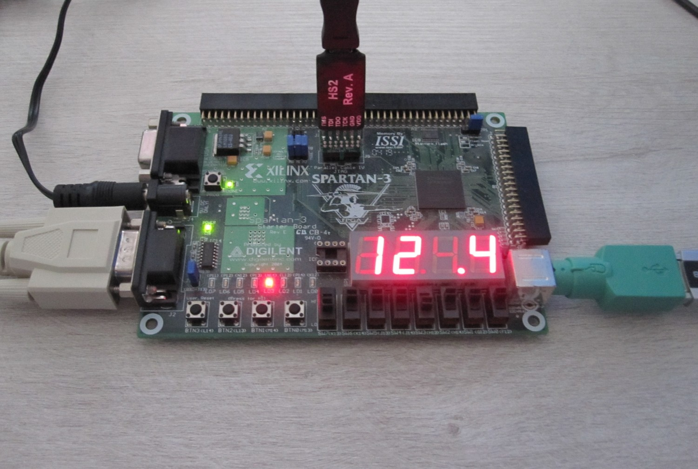
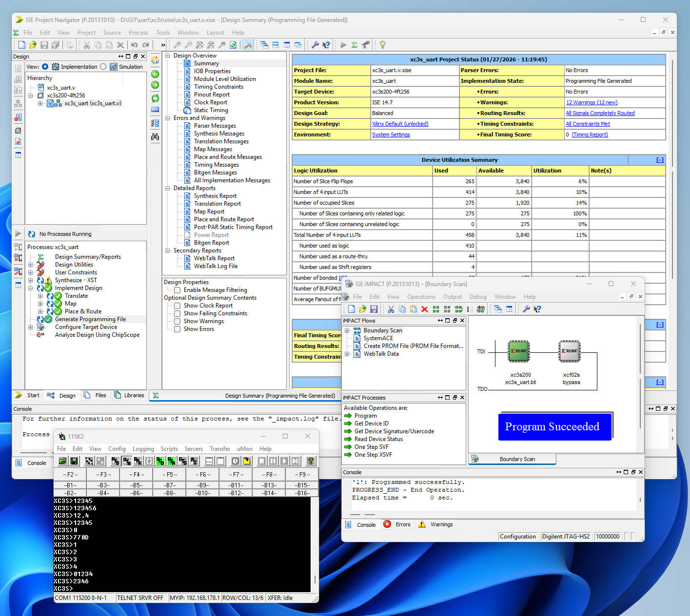
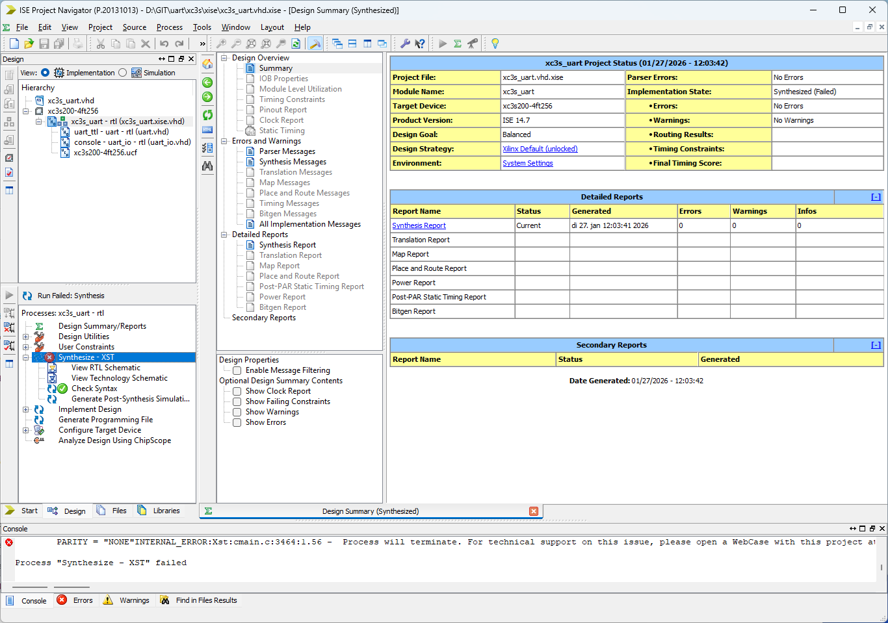

# UART

UART (Universal Asynchronous Receiver Transmitter) Verilog 2001 and VHDL 200X (2003) modules for FPGA. HW setup for <a href="https://github.com/krynentechnology/sr2cb">Intel&reg; Cyclone&reg; 10 LP Evaluation Kit</a>, <a href="https://github.com/krynentechnology/sr2cb">Lattice Semiconductor&reg; ECP5&#8482; Development Board</a> and Digilent Xilinx&reg; Spartan-3 Starter Kit Board.

<a href="https://github.com/nokyalr/ise-14.7-windows-11">Xilinx ISE 14.7</a> (free WebPack license) could be used to generate the Spartan-3 FPGA configuration file:

The Xilinx ISE 14.7 Verilog UART module is slightly modified (in a separate file), because Xilinx ISE 14.7 does not fully support Verilog 2001 (nor VHDL 200X)! The Xilinx ISE 14.7 VHDL 200X UART module does not synthesize, however the syntax check is ok (it does synthesize for the c10lp target):

